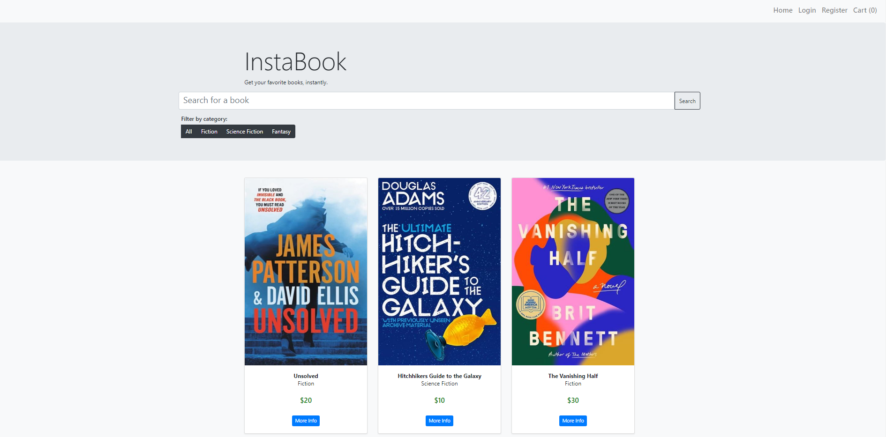
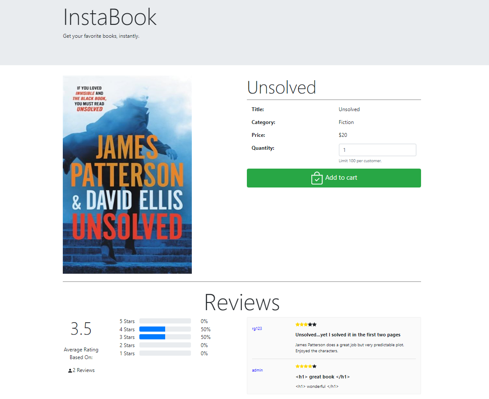
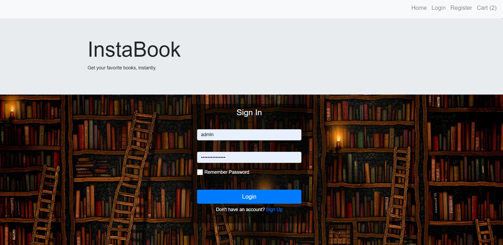
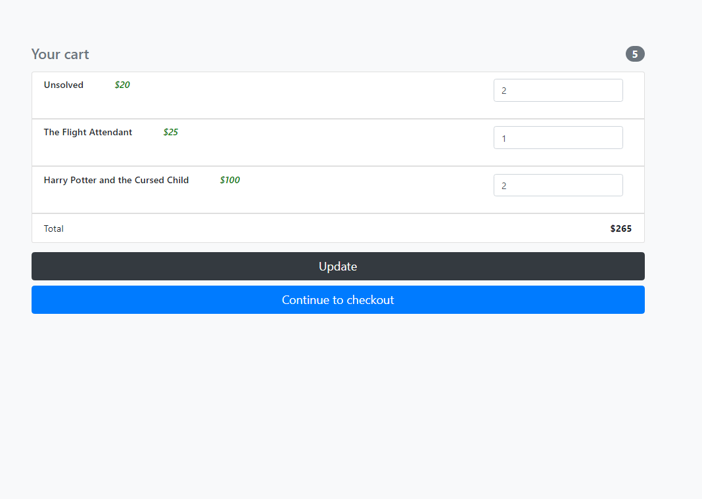
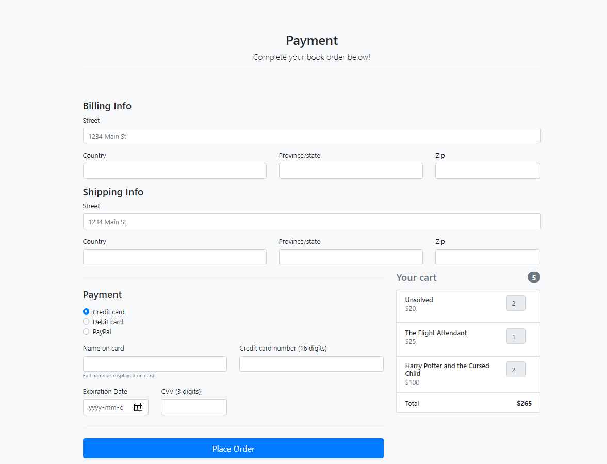
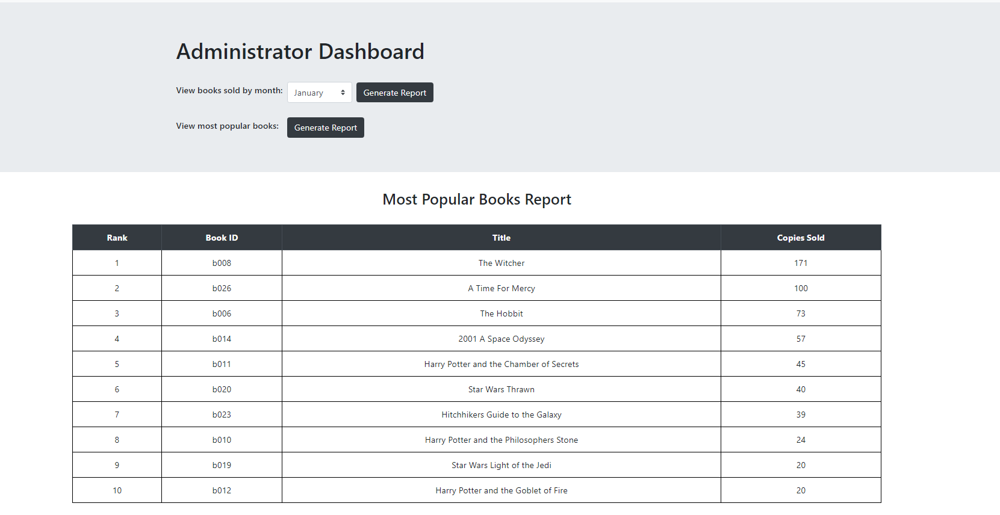

# instabook-bookstore

An e-commerce web app that sells books. Features a beautiful UI for browsing books, adding reviews, and for registering as a new user. Contains admin page to monitor book sales, as well as a REST API for fetching book or order information.

